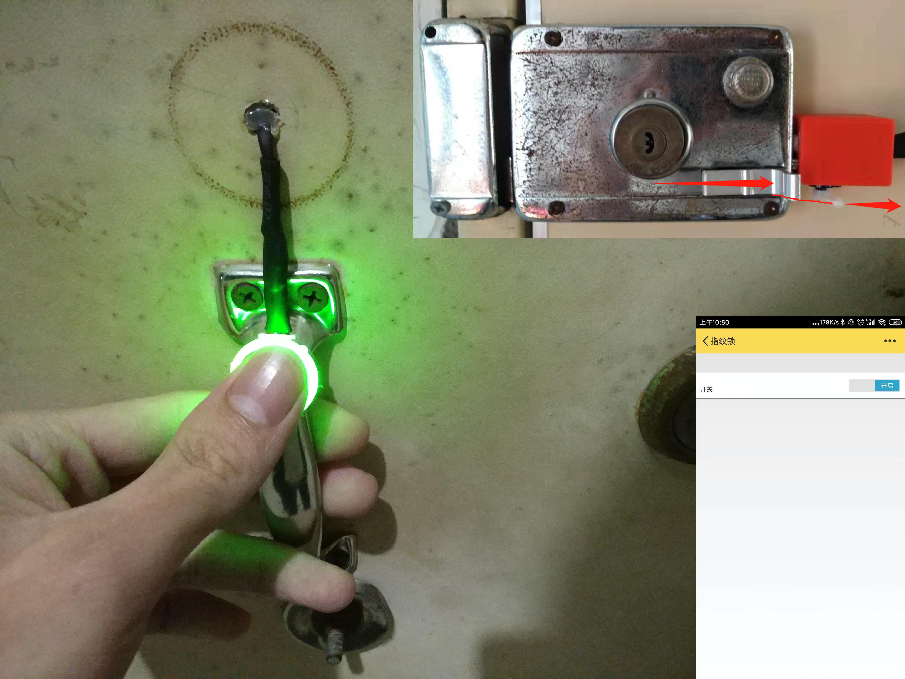
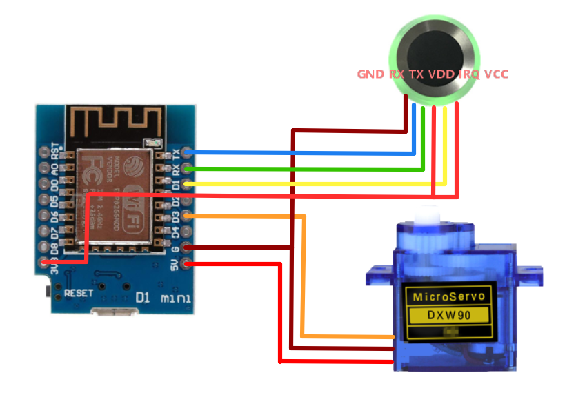
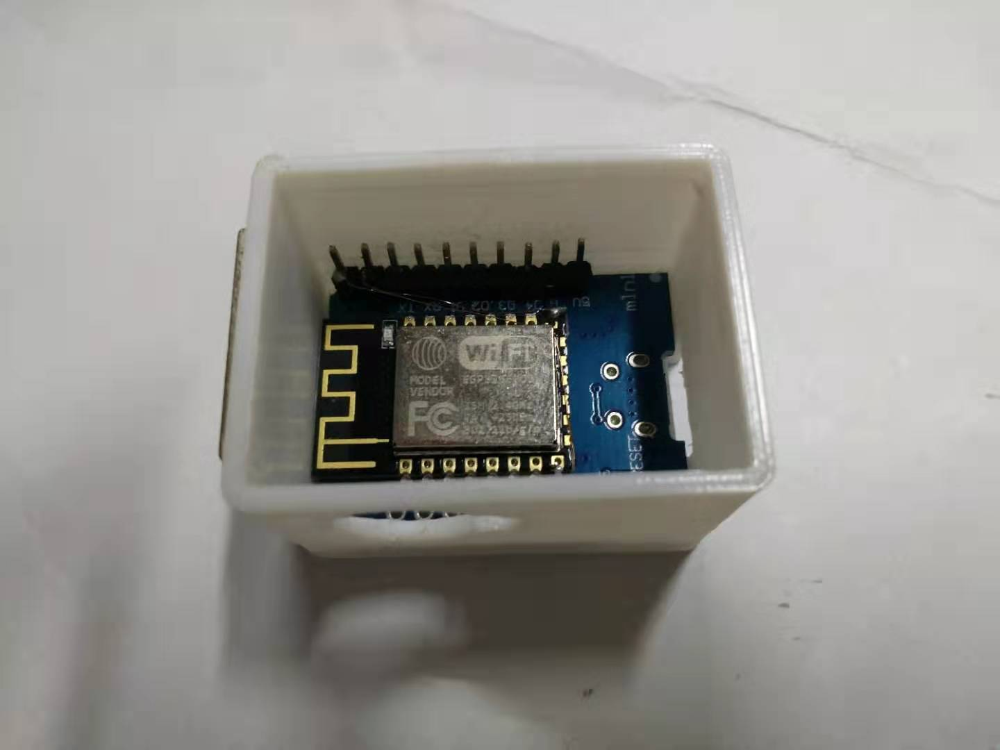
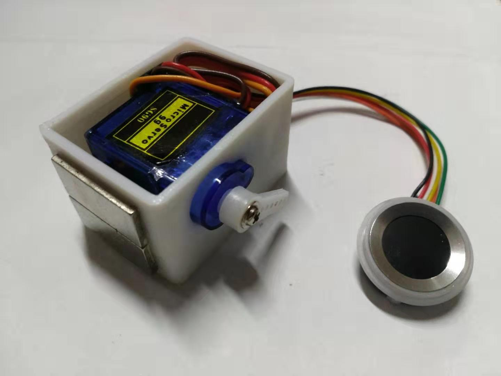
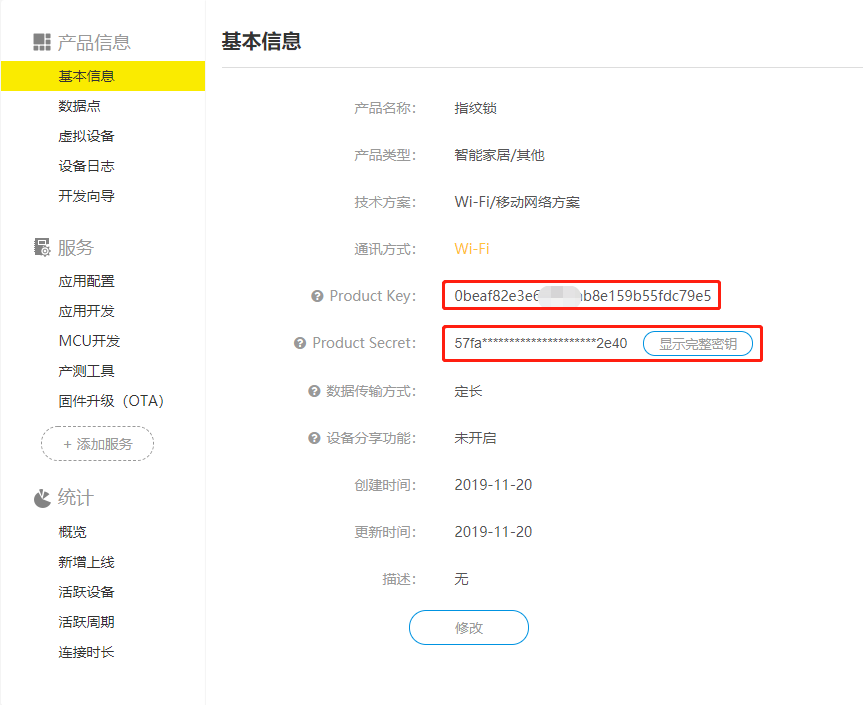
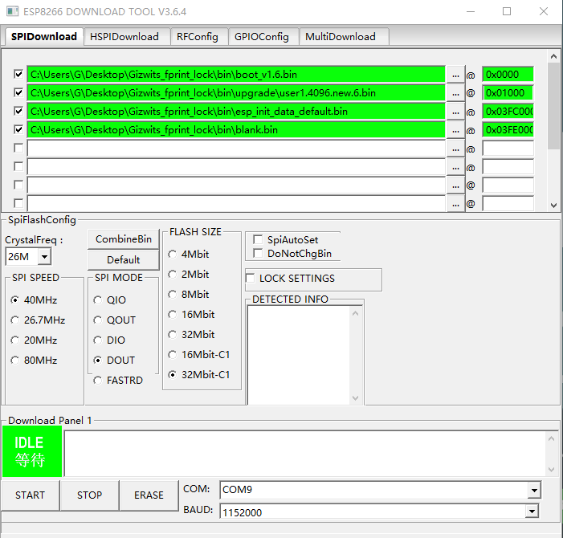
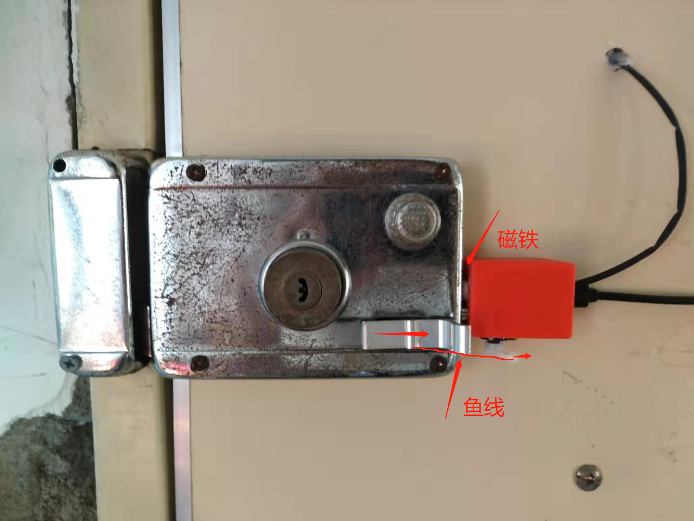

# Gizwits_Fingerprint_Lock
## ESP8266 机智云智能指纹门锁

使用机智云开发平台打造一款指纹门锁。使用机智云APP进行交互，方便管理，同时支持APP远程开锁。可支持使用舵机拉动普通门锁或使用电磁锁

### 使用说明
1. 配网
    * 连续上电三次，进入配置模式，LED常亮
    * 使用机智云APP一键配网
2. 数据透传
    * BA 02 ：录入指纹
    * BA 03 01 ：删除指纹  删除1号指纹 
    * AA 00 10 ：AA 最大角度 最小角度  角度范围[00-10]
    * AB 05 ：门锁开启多长时间自动关闭   5秒后关闭
3. 指纹说明
    * 唤醒蓝灯
    * 绿灯验证成功
    * 红灯验证失败
    * 黄灯验证时按下时间太短，读取不到指纹
    * 青色指纹录入模式，青->蓝->青->蓝->青->蓝->绿，手指放置三次

## 使用舵机拉动普通门锁的实现

### 硬件需要
1. ESP8266 D1 MINI
2. 指纹模块1016C
3. SG90 9g舵机
4. 鱼线(不易断的线就行)
5. 3D打印件(可省)
6. 磁铁(20*10*3)*2个(可省)

### 软件需要
1. CH341SER串口驱动
3. [安信可一体化开发环境](https://wiki.ai-thinker.com/ai_ide_install)
2. [ESP 模组烧录工具](https://wiki.ai-thinker.com/_media/tools/flash_download_tools_v3.6.6.zip)

### 制作方法
1. 接线示意图
    * 
2. 组装示意图
    * 没有打印件可直接将舵机粘到门上
    * 
    * 
3. clone 项目
4. 在[机智云](https://dev.gizwits.com/zh-cn/developer/)创建产品
5. 导入数据点
6. 修改 gizwits_protocol.h 文件
    * `PRODUCT_KEY`改为机智云产品 Product Key
    * `PRODUCT_SECRET`改为机智云产品 Product Secret
    *  
7. [编译下载](https://wiki.ai-thinker.com/esp8266)
    * 使用USB转TTL下载
    *  
8. 连续拔插电源三次蓝灯亮起进入配网模式
9. 使用机智云APP进行一键配网
10. 安装
    * 